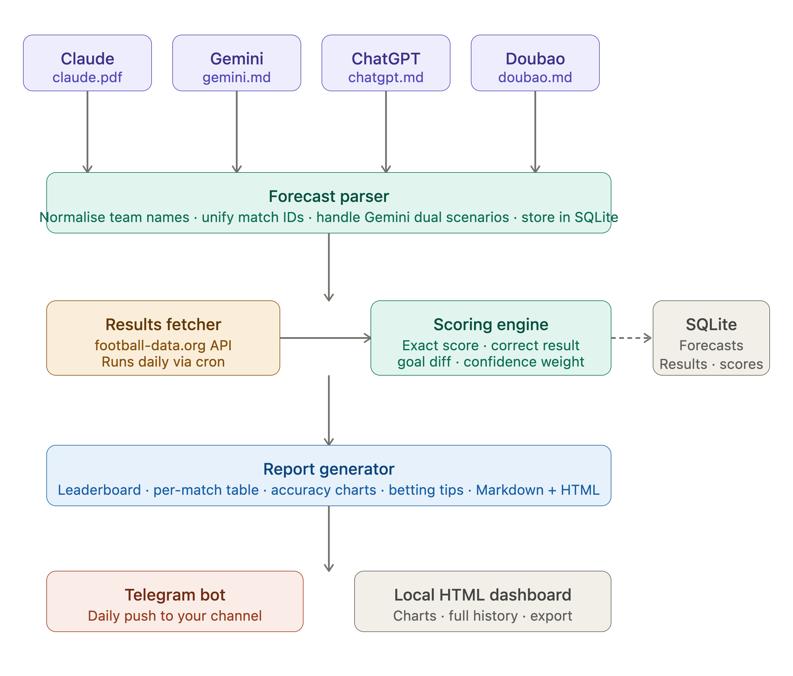

> **Initial architecture plan** — captured before implementation. Some design decisions were refined during build.
> See [`AGENTS.md`](../AGENTS.md) for the current project state.

Perfect — I have everything I need. Let me lay out the full plan.Here's the full system plan — no code yet, just the architecture for your review.

---

## System overview

**Name:** `WC2026 Forecast Tracker`
**Goal:** Parse 4 LLM forecasts → fetch real results daily → score each model → deliver a ranked comparison report to your Telegram.

---

## What I saw in your files

A few important notes before the plan:

**ChatGPT** had a different group K — it originally predicted Portugal vs **Jamaica** (not Congo DRC) and was missing the Uzbekistan vs Colombia match. The source data has been corrected (Jamaica → Congo DRC) per user confirmation.

**Gemini** uses two scenarios per match (Scenario 1 / Scenario 2), which needs special handling — we'll score both and track which scenario performs better.

**Claude PDF** is the most structured: includes match dates, confidence %, and a sequential match number — making it the easiest to auto-parse and the most comparable to real results.

**Doubao** includes group standings predictions and "best third place" qualifiers, giving extra scoring dimensions beyond just scorelines.

---

## Architecture



## Tech stack

**Runtime:** Python 3.11+ on your Mac (runs as a background LaunchAgent daemon)

**Storage:** SQLite — one local file, zero infra, stores all forecasts, results, and scores permanently

**Real results:** `football-data.org` free tier — your API key `c9e5f8d0...` is the one to use. Covers all FIFA World Cup matches with live scores.

**Scheduling:** macOS `launchd` (a `.plist` file) — runs the script once daily at your chosen time, no Docker needed

**Telegram:** Python `python-telegram-bot` library, sends a formatted message + attached HTML report to your personal channel

**Visualization:** `matplotlib` (charts embedded in HTML) + a self-contained HTML report file you can open locally or receive as a Telegram attachment

---

## Scoring model

Three tiers, combining into a total score per model per match:

| Tier | Points | Condition |
|------|--------|-----------|
| Exact score | 3 pts | Predicted score matches exactly |
| Correct result | 1 pt | Win/draw/loss direction correct |
| Goal difference | +0.5 bonus | Goal diff within 1 of actual |

For **Gemini**: both Scenario 1 and Scenario 2 are scored **independently** (not best-of-two). Each appears as a separate row in the leaderboard. This gives a fuller picture of model performance than cherry-picking the better scenario.

For **Claude PDF**: confidence % used as a weight multiplier on the **result tier** (1 pt) and **diff bonus** (0.5 pt), but NOT on the exact-score tier (3 pts). This rewards calibrated confidence — a 90% confident correct result earns more than a 50% confident one.

---

## What the daily Telegram report contains

1. **Leaderboard** — ranked table: Model | Exact scores | Correct results | Total pts | % accuracy
2. **Today's matches** — side-by-side prediction vs real result for each model
3. **Running accuracy chart** — PNG image of accuracy over time as matches accumulate
4. **Betting signal** — which model to follow today based on recent form (last 5 matches)
5. **Surprise flag** — if actual result matched no model's prediction, flagged as a high-uncertainty match type

---

## Recommended platform: standalone Python script + launchd

Rather than Hermes or OpenCode, a **plain Python script** is the right tool here because:
- No LLM needed at runtime (pure data comparison)
- Runs reliably as a cron-style daemon on your Mac
- Sends directly to Telegram with no middleware
- Full control over scoring logic with no agent hallucination risk (you said no hallucination — this is the safest path)
- OpenCode/Hermes would add complexity without benefit for a deterministic scoring task

If you want OpenCode `/goal` involved, it could be used for the one-time setup task of parsing and normalising your 4 forecast files into the database — that's a good fit for an agentic tool. The daily runner stays as a plain script.

---

## Project file layout

```
wc2026-tracker/
├── data/
│   ├── claude.pdf
│   ├── gemini.md
│   ├── chatgpt.md
│   └── doubao.md
├── forecasts.db          ← SQLite
├── parse_forecasts.py    ← one-time: load all 4 files into DB
├── fetch_results.py      ← daily: pull real scores from API
├── score.py              ← daily: compare + update scores
├── report.py             ← daily: generate HTML + charts
├── telegram_send.py      ← daily: push to your channel
├── run_daily.py          ← orchestrator (calls all 4 above)
└── com.wc2026.tracker.plist  ← macOS launchd schedule
```

---

## Key decision to confirm before I build

1. **Daily run time** — what time do you want it to fire? (Suggest 8am Vancouver = after most European-time results are confirmed)
2. **Telegram target** — is your API key `c9e5f8d0...` a bot token or a football-data key? You'll need a Telegram bot token separately (free, BotFather)
3. **Gemini scoring** — score best-of-two scenarios, or score both independently and track separately?
4. **ChatGPT group K discrepancy** — it predicted Portugal vs Jamaica, not Congo DRC. Resolved: source data corrected (Jamaica → Congo DRC).

Confirm and I'll start building.