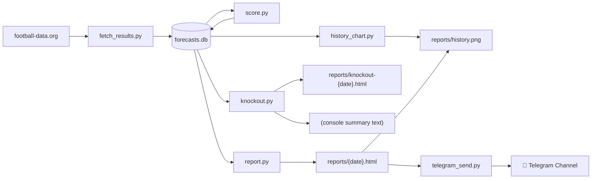
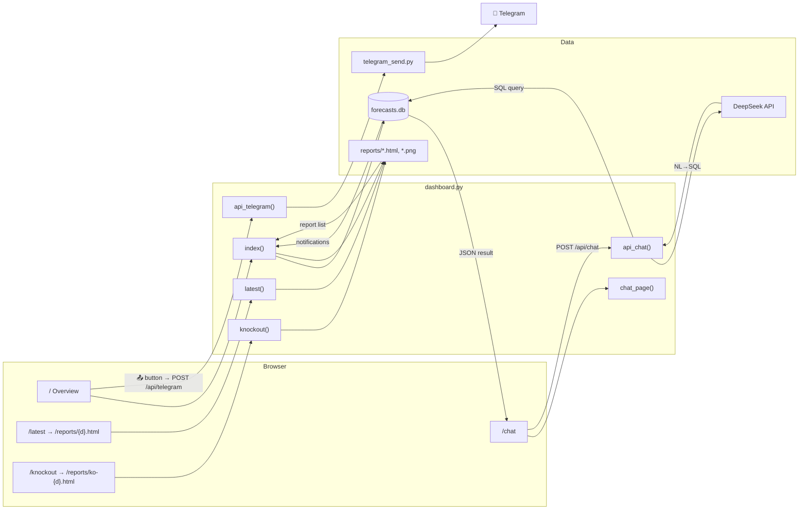
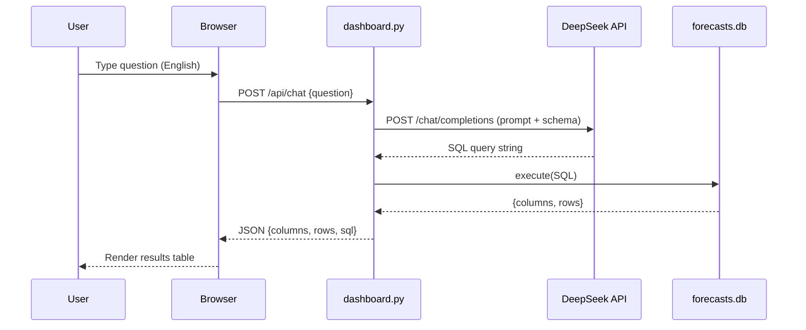
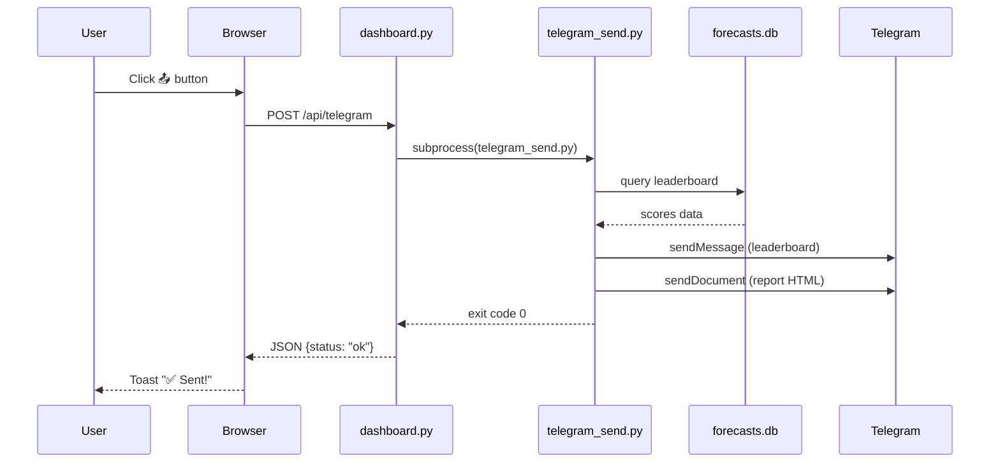

# WC2026 Forecast Tracker — Routes, APIs & Data Flow

## 1. Dashboard Routes ↔ Menu Navigation

```
┌─────────────────────────────────────────────────────────────────┐
│  ⚽ WC2026 Forecast Tracker    [📊 Report] [🏆 Bracket] [💬 Chat] [📤] │  ← same on every page
└─────────────────────────────────────────────────────────────────┘
```

| Nav Label | Route | What it does | What you see |
|-----------|-------|-------------|--------------|
| *(logo)* `⚽ WC2026 Forecast Tracker` | `GET /` | Overview page | Notifications panel, score history chart, lists of past reports & past brackets |
| `📊 Report` | `GET /latest` | Redirect → most recent daily report | Full daily report: leaderboard, accuracy chart, match forecasts, model comparison |
| `🏆 Bracket` | `GET /knockout` | Redirect → most recent knockout page | 32-team bracket: R32 → R16 → QF → SF → Final |
| `💬 Chat` | `GET /chat` | NL→SQL chat interface | Chat box where you ask questions in English, get results from the database |
| `📤` (button) | `POST /api/telegram` | Send latest report to Telegram | Toast notification: "✅ Sent!" or error |

### Behind the scenes

| Hidden Route | Type | Purpose | How you reach it |
|-------------|------|---------|-----------------|
| `GET /reports/*` | static file mount | Serves all generated HTML reports + PNG charts | Indirectly — `/latest` redirects to `/reports/2026-06-16.html`, `/knockout` redirects to `/reports/knockout-2026-06-16.html`. Also linked directly from the Overview page tables |
| `GET /favicon.ico` | inline SVG | ⚽ favicon | Browser auto-request |

### The mental model

```
         ┌──────────────────┐
         │  / (Overview)    │  ← Notifications, chart, links to everything
         │  Logo click ─────┼──┐
         └──────────────────┘  │
                               ▼
    ┌──────────────────┐  ┌──────────────────┐  ┌──────────────────┐
    │  /latest          │  │  /knockout       │  │  /chat            │
    │  → daily report   │  │  → bracket page  │  │  → chat query     │
    │  /reports/{d}.html│  │  /reports/ko-..  │  │  (standalone)     │
    └──────────────────┘  └──────────────────┘  └──────────────────┘
```

---

## 2. API Endpoints ↔ Python Backing

| Endpoint | Method | Python Handler | Backing Script(s) | What happens |
|----------|--------|---------------|-------------------|-------------|
| `/api/chat` | POST | `dashboard.py :: api_chat()` | `forecasts.db` (SQLite) | Receives NL question → calls DeepSeek API → gets SQL → executes against DB → returns JSON `{columns, rows, sql}` |
| `/api/telegram` | POST | `dashboard.py :: api_telegram()` | `telegram_send.py :: main()` | Subprocess‑spawns `telegram_send.py` → builds leaderboard text from DB → sends to Telegram channel via bot |

### Script → Function map (full project)

| Script | Entry Point | Purpose | Called by |
|--------|------------|---------|-----------|
| `dashboard.py` | `main()` / uvicorn | FastAPI web server (overview, reports, chat, Telegram trigger) | `python3 dashboard.py` |
| `run_daily.py` | `main()` | Orchestrates the daily pipeline | `python3 run_daily.py` |
| `fetch_results.py` | `main()` | Fetch match results from football-data.org API → DB | `run_daily.py` |
| `score.py` | `main()` | Compare predictions vs results, compute scores → DB | `run_daily.py` |
| `history_chart.py` | `main()` | Generate multi-model score history line chart PNG | `run_daily.py` |
| `knockout.py` | `main()` | Compute group standings, simulate knockout bracket → HTML | `run_daily.py` |
| `report.py` | `main()` | Generate daily report HTML + charts | `run_daily.py` |
| `telegram_send.py` | `main()` | Send leaderboard text + report to Telegram | `run_daily.py`, `dashboard.py POST /api/telegram` |
| `parse_forecasts.py` | `main()` | (One‑time) Parse 6 LLM forecast files → SQLite | `python3 parse_forecasts.py` |
| `fetch_deepseek_forecast.py` | `main()` | (One‑time) Call DeepSeek API → `data/deepseek.md` | `python3 fetch_deepseek_forecast.py` |

---

## 3. Data Flow (Mermaid)

### Daily pipeline (`run_daily.py`)



### Web dashboard (`dashboard.py`)



### NL→SQL chat flow



### Telegram send flow


